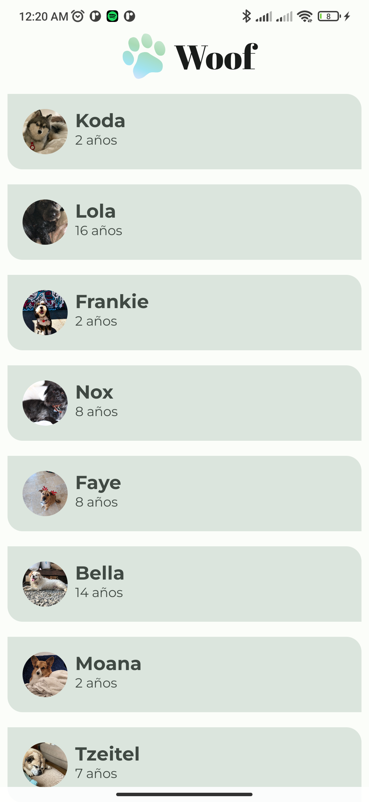
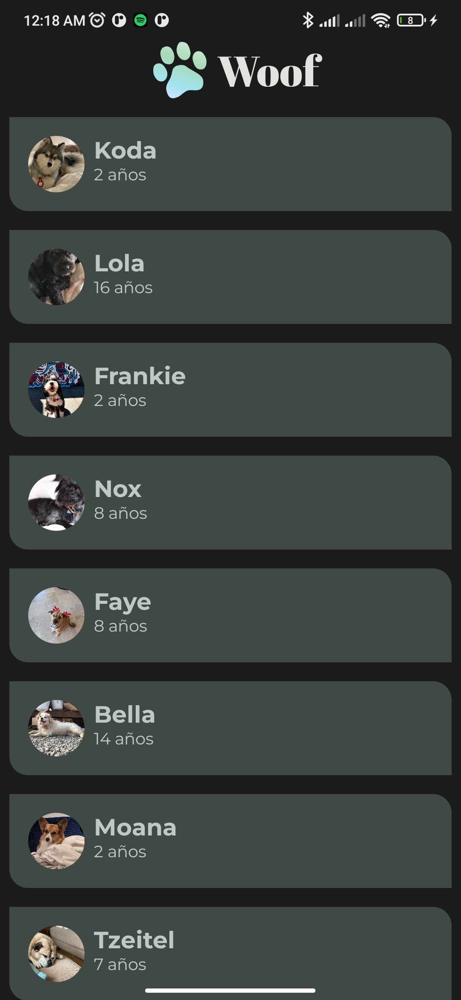

# Woof: Themes con Compose y Material 3

Práctica de **Axel Adrián Gaviña González**, basada en el [codelab oficial](https://developer.android.com/codelabs/basic-android-kotlin-compose-material-theming?hl=es-419).

## Entregables

- [Informe PDF con resultados, evidencias y conclusiones](docs/Informe-Woof-Material3.pdf).
- [Historial de cambios por etapas](https://github.com/Axel421-yn/woof-compose-material3/commits/main/).
- [Capturas originales y registros](docs/evidencias/).

## Resultado

 

Capturas reales de Woof en un **Xiaomi Redmi 9, Android 11 / API 30**, conectado por USB a la PC Windows. Se compiló en la PC y se ejecutó en el teléfono; no se utilizó un emulador.

## Implementación

- Lista desplazable con los nueve perros del proyecto original.
- Paletas verdes clara y oscura según el modo del sistema.
- Tarjetas con esquinas asimétricas y fotografías circulares.
- Abril Fatface para el título y Montserrat para nombres y edades.
- Barra superior centrada con logo y título Woof.
- Previews claro y oscuro en `MainActivity.kt`.
- Edades con plurales y recursos en español.
- Color dinámico en Android 12+, desactivado por defecto para conservar la paleta.

## Compilar y ejecutar

Abrir la carpeta raíz en Android Studio. Usar un JDK compatible con Gradle 9.5.0 (17 o superior), Android SDK 37 y Build Tools 36.0.0. Android Studio genera `local.properties` con la ruta del SDK. El wrapper está incluido.

En Windows:

```powershell
.\gradlew.bat :app:assembleDebug :app:lintDebug
```

En macOS/Linux:

```sh
./gradlew :app:assembleDebug :app:lintDebug
```

La primera sincronización puede requerir Internet. El APK queda en `app/build/outputs/apk/debug/app-debug.apk`.

Seleccionar un dispositivo Android 7 / API 24 o posterior y ejecutar `app` desde Android Studio. Cambiar el modo claro/oscuro del sistema y desplazar la lista hasta **Leroy**. Para probar color dinámico en API 31+, pasar `dynamicColor = true` a `WoofTheme`; desactivarlo al terminar.

Versiones: AGP 9.3.3, Gradle 9.5.0, Kotlin/Compose Compiler 2.2.10, Compose BOM 2026.02.01, compileSdk 37, targetSdk 35 y minSdk 24. AGP 9 usa Kotlin integrado; no se aplica el plugin `org.jetbrains.kotlin.android` por separado.

## Validación: 3 de octubre de 2026

| Comprobación | Resultado |
| --- | --- |
| assembleDebug y lintDebug | BUILD SUCCESSFUL, 30 s |
| Lint | 0 errores, 28 advertencias; reporte completo adjunto |
| Instalación ADB | Success |
| Apertura de MainActivity | Status: ok |
| Tema claro y oscuro | Verificados visualmente y capturados |
| Desplazamiento hasta Leroy | Verificado; gesto manual del usuario |
| Color dinámico | No verificado: el teléfono tiene API 30 |

Las advertencias incluyen sugerencias de versiones, recursos sin uso y recursos gráficos heredados. No se desactivó Lint ni se agregó un baseline. Rotación y lector de pantalla no se probaron formalmente.

La versión capturada corresponde al commit remoto `f34cc82` (commit local `394c3bb`). Posteriormente se completaron traducciones no visibles y el plural `many` para resolver Lint, sin modificar el diseño. Se restauró el tema oscuro original del teléfono.

## Archivos principales

| Archivo | Responsabilidad |
| --- | --- |
| MainActivity.kt | Lista, tarjetas, barra y previews |
| data/Dog.kt | Modelo y nueve registros |
| ui/theme/Color.kt | Paletas |
| ui/theme/Theme.kt | Selección y aplicación del tema |
| ui/theme/Shape.kt | Formas |
| ui/theme/Type.kt | Fuentes y estilos |
| app/src/main/res | Fotos, logo, fuentes y textos |
| docs | Informe, capturas y registros |

Los archivos Kotlin se encuentran en `app/src/main/java/com/example/woof/`.

## Historial y atribución

Los commits separan proyecto inicial, colores, formas, fuentes, interfaz, compatibilidad, correcciones y documentación. Los recursos binarios se cargaron primero y después se organizaron en sus rutas Android.

El código inicial y parte de la solución temática se adaptaron del [repositorio oficial Woof](https://github.com/google-developer-training/basic-android-kotlin-compose-training-woof), ramas `starter` y `material`. Se conservaron autoría y licencias [Apache 2.0](LICENSE) y [SIL Open Font License](ASSETS_LICENSE.txt). Los ajustes de compatibilidad, contraste de barras, colores explícitos de tarjetas, plurales, traducciones y documentación forman parte de esta entrega.
